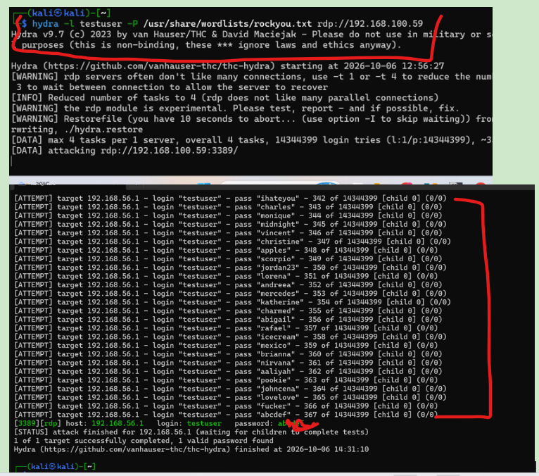
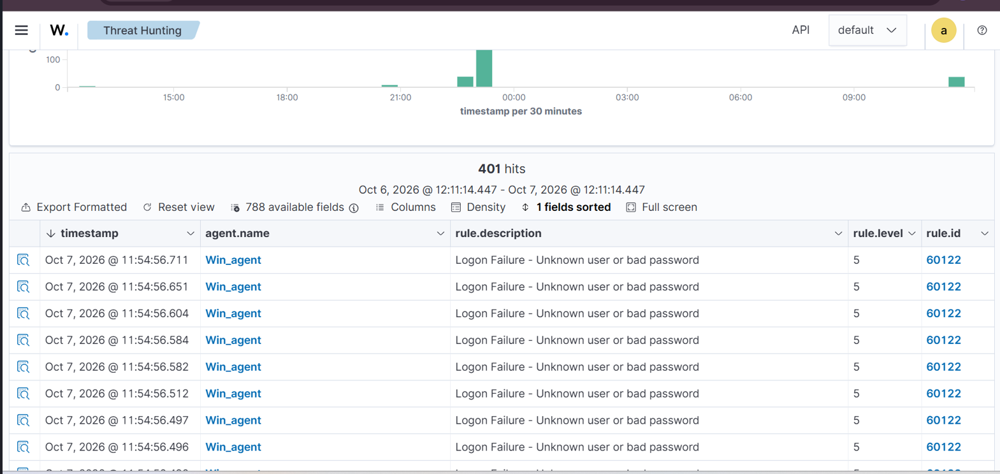
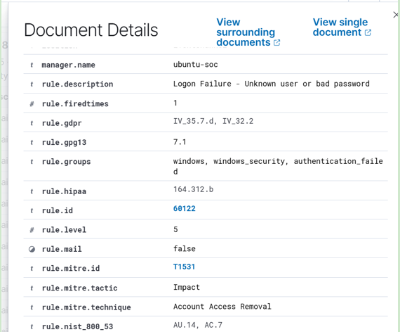
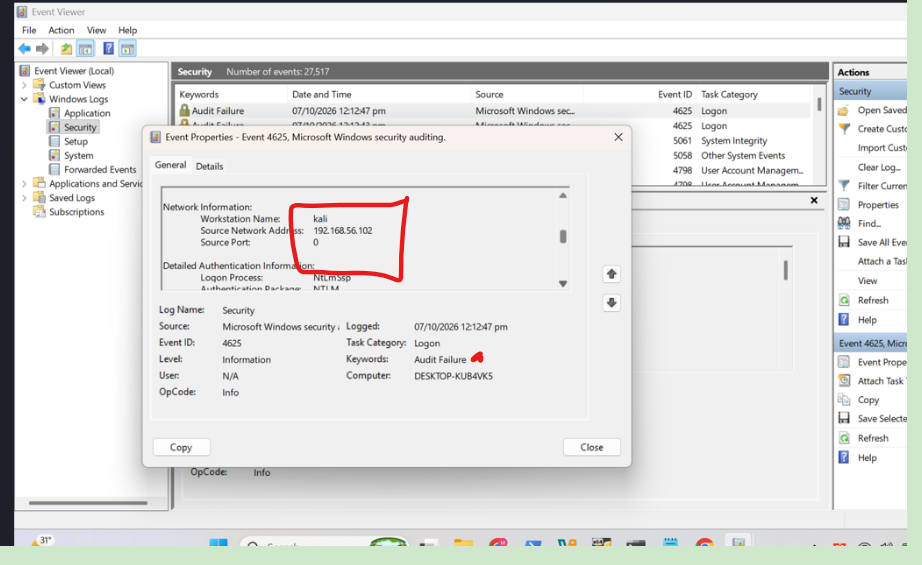
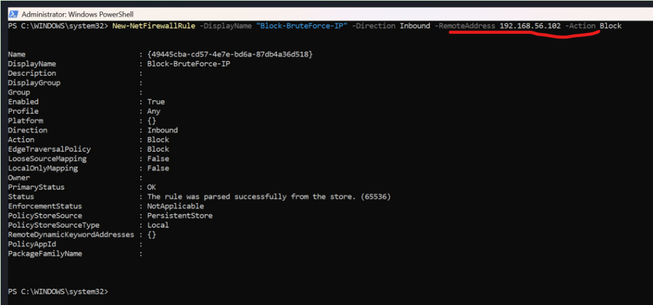
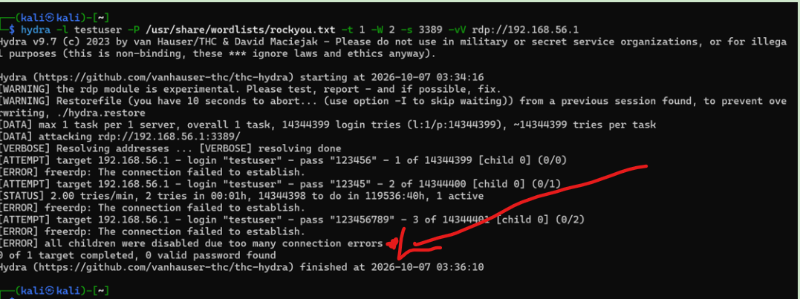
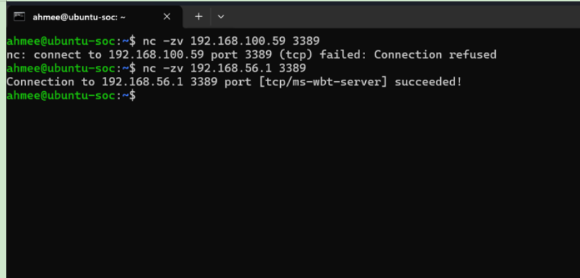

# Incident Response Lab — RDP Brute Force Attack
### Mapped to NIST SP 800-61 Revision 3 (2025) / CSF 2.0

NIST withdrew the older four-phase incident response model (Preparation, Detection &
Analysis, Containment/Eradication/Recovery, Post-Incident Activity) in April 2025. The
current guidance, SP 800-61 Revision 3, integrates incident response into the six functions
of the NIST Cybersecurity Framework 2.0: **Govern, Identify, Protect, Detect, Respond,
Recover**. This report documents a simulated RDP brute-force attack and the full response,
structured around that current model.

## Scenario
An attacker on a Kali Linux VM (`192.168.56.102`) used Hydra with the rockyou.txt wordlist
to brute-force RDP credentials on a Windows host (`192.168.56.1`), targeting the `testuser`
account. Wazuh, running on a separate Ubuntu Server manager, monitored the Windows host via
an installed agent.

## 1. Govern
This exercise was documented against a current, named standard (NIST SP 800-61 Rev. 3)
rather than an outdated one, following a repeatable process: simulate → detect → respond →
recover → document — the same discipline applied regardless of lab or production scale.

## 2. Identify
**Asset:** Windows 10/11 VM, monitored by a Wazuh agent, with RDP (port 3389) enabled.
**Account in scope:** `testuser`, added to the local Remote Desktop Users group.
**Risk:** An internet- or network-exposed RDP service with a weak password policy is one of
the most common real-world initial-access vectors, making this a realistic, high-value
scenario to test.

## 3. Protect
Before the attack, the Windows host had Wazuh actively monitoring Security and Sysmon event
channels, and Windows Firewall was active. One protection was deliberately *absent* for this
exercise: the account lockout threshold was disabled (`net accounts /lockoutthreshold:0`),
allowing unlimited login attempts. This mirrors a real, common misconfiguration — many
breaches succeed specifically because lockout policies were never enabled.

## 4. Detect
**Method:** `hydra -l testuser -P /usr/share/wordlists/rockyou.txt rdp://192.168.56.1`,
run from Kali, finished at **2026-10-06 14:31:10**, successfully cracking the password
(`abcdef`).



**Wazuh detection:** The attack generated **468 total alerts**, with **62 alerts (89.86%)**
tagged under MITRE **T1110 — Brute Force**. Individual failed-logon events were also matched
to Rule ID `60122` (Level 5, MITRE T1531 — Account Access Removal), the base rule for a
single bad-password attempt; the aggregate pattern across many attempts is what correctly
escalated the classification to Brute Force in the dashboard.






**Source attribution:** Windows Event Viewer confirmed the attacker's workstation name
(`kali`) and source IP (`192.168.56.102`) directly in the raw Security log (Event ID 4625),
independently corroborating the Wazuh alert.



## 5. Respond
The attacking IP was blocked at the Windows Firewall:
```powershell
New-NetFirewallRule -DisplayName "Block-BruteForce-IP" -Direction Inbound -RemoteAddress 192.168.56.102 -Action Block
```
This single action served both containment (cutting the attacker's active path) and
eradication (removing their means of further access) as Blocking the attacking IP is clearly containment. It is not automatically eradication. If there was no malware, persistence, compromised account, or other attacker foothold to remove, then there may have been nothing to eradicate in this particular lab. — in CSF 2.0, both fall under Respond
rather than being separate phases.



## 6. Recover
Two checks confirmed the response was both effective and non-disruptive:

**Attacker blocked:** Re-running the identical Hydra command from Kali after the block
resulted in repeated connection failures — "0 of 1 target completed, 0 valid passwords
found" — confirming the attacker could no longer reach the service at all.



**Service still available to legitimate hosts:** A port check from the Ubuntu manager
(a different, non-blocked IP) confirmed RDP remained reachable —
`nc -zv 192.168.56.1 3389` succeeded — proving the fix was targeted at the attacker
specifically, not a blanket service outage.



## Lessons Learned
1. **Enable account lockout policy.** This lab intentionally disabled it to observe
   unrestricted attack behavior; in any real environment, a lockout threshold (e.g., 5
   attempts) would have stopped this attack automatically, long before 14,344,399 possible
   passwords were queued.
2. **Require MFA on RDP**, so a cracked password alone is insufficient for access.
3. **Avoid exposing RDP directly** — a VPN or bastion host in front of RDP removes it as a
   directly internet-reachable brute-force target entirely.
4. **Detection worked as intended** — Wazuh correctly identified and classified the pattern
   as brute-force activity (MITRE T1110) without custom rules, validating the default
   ruleset's effectiveness for this attack type.
